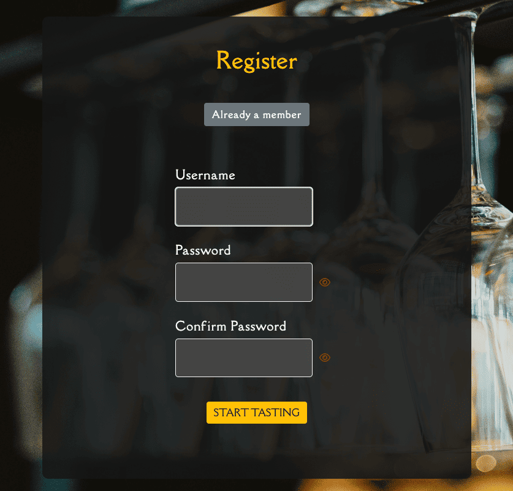
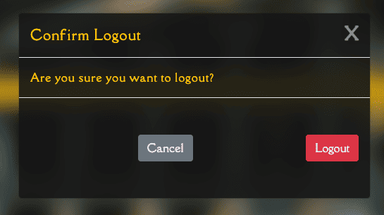
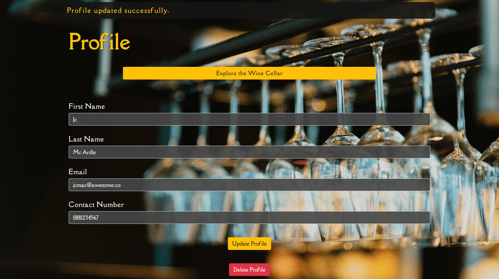
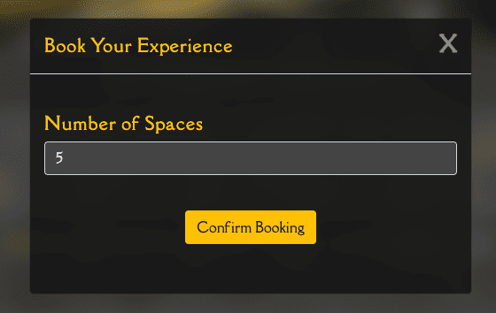
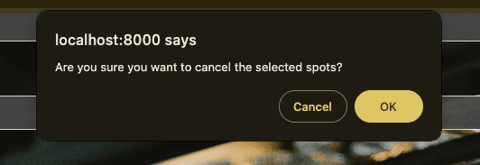
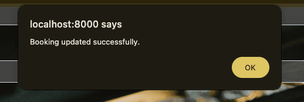

# 🍷 Wine Bar Experience 🍷

Live link: [Booking App site](https://the-wine-bar-5c52e3b945e9.herokuapp.com/)


<p>Welcome to the <strong>Wine Bar booking system</strong> a place where technology and tradition come together to create unforgettable wine-tasting moments. Imagine yourself in a cozy restaurant, surrounded by walls that come alive with projections of picturesque vineyards and stunning landscapes from around the world. This application is your gateway to curated wine adventures, right from your screen to the perfect evening under the stars.</p>


## Table of Contents

<ul> 
<li><a href="#about-the-project">About the Project</a>
  <ul>
    <li><a href="#purpose">Purpose</a></li>
    <li><a href="#target-audience">Target Audience</a></li>
    <li><a href="#data">Data</a></li>
    <li><a href="#security-features">Security Features</a></li>
  </ul>
</li>
<li><a href="#design-section">Design Section</a></li>
<li><a href="#user-stories">User Stories</a>
  <ul>
    <li><a href="#users">Users</a></li>
    <li><a href="#admin">Admin</a></li>
  </ul>
</li>
<li><a href="#features">Features</a>
  <ul>
  <li><a href="#curated-selection-of-wine-tasting-events">Curated Selection of Wine-Tasting Events</a></li>
    <li><a href="#personalised-user-registration-login-logout-and-profile-management">Personalised User Registration, Login, Logout and Profile Management</a></li>
    <li><a href="#real-time-booking-system">Real-Time Booking System</a></li>
    <li><a href="#responsive-and-dynamic-design">Responsive and Dynamic Design</a></li>
    <li><a href="#comprehensive-admin-panel">Comprehensive Admin Panel</a></li>
  </ul>
</li>
<li><a href="#setup-and-installation">Setup and Installation</a>
</li>
<li><a href="#deployment">Deployment</a>
  <ul>
    <li><a href="#create-the-heroku-app">Create the Heroku App</a></li>
    <li><a href="#update-your-code-for-deployment">Update Your Code for Deployment</a></li>
    <li><a href="#deploy-on-heroku">Deploy on Heroku</a></li>
  </ul>
</li>
<li><a href="#technologies-used">Technologies Used</a></li>
<li><a href="#testing">Testing</a>
  <ul>
    <li><a href="#running-tests">Running Tests</a></li>
    <li><a href="#coverage-report">Coverage Report</a></li>
    <li><a href="#additional-testing">Additional Testing</a></li>
  </ul>
</li>
<li><a href="#credits">Credits</a></li>
<li><a href="#recent-changes-and-improvements">Recent Changes and Improvements</a></li>
</ul>

## About the Project

### Purpose

<p>This is a Django-powered web application that manages the backend operations for booking and managing wine-tasting events. It handles user authentication, event scheduling, and booking management. The backend ensures seamless data flow between the database and the user interface, providing a robust platform for wine enthusiasts to explore and book immersive tasting experiences.</p>


### Target Audience

The primary target audiences include:
- **Wine Enthusiasts**: Individuals who have a passion for wine and are looking for new and exciting tasting experiences.
- **Event Organisers**: Businesses and individuals who organise wine-tasting events and need a platform to manage bookings and user interactions.
- **Restaurant Owners**: Establishments that host wine-tasting events and want to offer their customers a unique and memorable experience.

### Data

We manage different types of data to ensure a smooth and personalised experience:
- **User Data**: Information related to user registration, login, and profile management. This includes usernames, passwords, email addresses, and profile details.
- **Event Data**: Details about the wine-tasting events, such as event titles, descriptions, dates, times, and available spots.
- **Booking Data**: Information about user bookings, including the number of spots reserved, booking dates, and associated wine-tasting events.

### Security Features

Security is a critical part of the project. Several measures have been implemented for the safety and privacy of user data:
- **User Authentication**: The application uses Django's built-in authentication system to manage user registration and login securely.
- **Data Encryption**: Sensitive data, such as passwords, are encrypted using industry-standard hashing algorithms.
- **CSRF Protection**: (CSRF) is enabled to prevent unauthorized actions on behalf of authenticated users.
- **SSL/TLS**: Secure Sockets Layer and Transport Layer Security are used to encrypt data transmitted between the client and server, ensuring secure communication.
- **Session Management**: Secure session cookies are used to manage user sessions, with settings to prevent session hijacking and fixation.
- **Access Control**: Role-based access control is implemented to restrict access to certain parts of the application based on user roles (e.g., admin, user).
<br>

Return to [Table of Contents](#table-of-contents)

## Design Section

This section outlines the design process and decisions for "The Wine Bar," an online booking system for wine-tasting events. The design blends elegance with usability, creating a wine-inspired experience rooted in UX principles.

### Wireframes
Below are conceptual wireframes for key pages, designed to ensure usability across desktop, tablet, and mobile devices.

- **Homepage**  
  - Layout: Header with navigation bar (Home, events, Register/ login), hero section with a welcome message.
    
  - Purpose: Quick access to bookings, register and login. 
   
  
<br>

- **Booking Page**  
  - Layout: Compact form with fields for date, time, and party size, plus a "Book Now" button. There is a simple model to complete the booking.
   
  - Purpose: Streamlined booking process for mobile/ desktop users.   
  
  
<br>

- **Profile Page**  
  - Layout: A simple layout with user information (name, email, contact number). There is also a section on the page for the booked events (They can edit or cancel booking from here). 
  
  - Purpose: All the required information the user needs in one place. (Also updates admin side)
  
  
<br> 

- **Admin Panel**  
  - Layout: The use of the Django admin panel is all I need for this project.   

  - Purpose: Easy management of booking and users records.
   
   

### Color Scheme
The color palette is defined in the CSS `:root` variables, inspired by wine culture and designed for contrast and readability:
- **Primary Text Color**: `rgb(243, 243, 243)` (#F3F3F3, Light White) - Main text for legibility against dark backgrounds.  
- **Secondary Text Color**: `rgb(187, 187, 187)` (#BBBBBB, Light Gray) - Subtle text variations (e.g., labels or secondary info).  
- **Tertiary Text Color**: `rgb(152, 152, 152)` (#989898, Medium Gray) - Additional hierarchy for less prominent text.  
- **Alert Text Color**: `rgb(211, 25, 44)` (#D3192C, Bright Red) - Error messages or alerts (e.g., form validation).  
- **Gold Accent**: `#ffc107` (Golden Yellow) - Highlights buttons and key actions/ areas, evoking premium wine quality.  
- **Primary Background**: `rgba(71, 71, 71, 0.9)` (#474747 with 90% opacity, Dark Gray) - Main content background with a sleek, semi-transparent look.  
- **Secondary Background**: `rgba(21, 21, 21, 0.9)` (#151515 with 90% opacity, Near Black) - Deeper contrast for headers or overlays.  
- **Text Shadow**: `1px 1px 1px rgba(0, 0, 0, 0.6)` - Subtle shadow for text to enhance readability on varied backgrounds.

### Typography
Typography is defined in the `body` CSS, prioritizing a refined and thematic aesthetic:
- **Font Family**: `'Della Respira', serif` - A serif font with a classic, elegant feel, reminiscent of wine labels and vintage charm.  
- **Letter Spacing**: `1px` - Adds subtle spacing for improved readability and a polished look.

### Design Rationale
The design ties functionality to a cohesive wine-tasting theme:
- **Navigation**: Intuitive menu labels ("Home, Wine Celler, Register, Uncork Access") ensure easy access to core features.  
- **Responsiveness**: The layout adjusts seamlessly across devices, with forms and tables optimized for all screen sizes.  
- **Theme**: A fixed background image (`empty_glasses.jpg`) of empty wine glasses, styled with `background-size: cover`, `background-repeat: no-repeat`, and `background-position: center`, sets a sophisticated tone. Dark semi-transparent backgrounds (`--bg-color`, `--bg-color2`) overlay this image, ensuring content readability while maintaining the wine aesthetic. The `--gold-color` accents buttons, and `--text-color` (light white) ensures text stands out.  
- **User Interaction**: Interactive elements (e.g., "Book Now" button) use `--gold-color` for prominence, while `--text-alert` provides clear error feedback. The `'Della Respira'` font enhances the wine-cellar vibe, with `1px` letter spacing adding refinement.


Return to [Table of Contents](#table-of-contents)

## User Stories

<h3>Here’s is what I’ve set out to build:</h3>

<p>You will find more information regarding stories on my projects in my Github. I used AGILE to keep track of the build process. This aloud me to understand what was achievable and what was a goal to far (This time 😉).</p>

Project link: [AGILE for wine Bar](https://github.com/users/TerryLoc/projects/3)

### Users

<ul> 
<li><strong>As a User:</strong> I want to create an account so that I can book wine-tasting events.</li> 
<li><strong>As a User:</strong> I want to view all available experiences so I can pick the perfect one.</li> 
<li><strong>As a User:</strong> I want detailed information about each event to make an informed decision.</li> 
<li><strong>As a User:</strong> I want to book events for myself and my friends to enjoy together.</li> 
<li><strong>As a User:</strong> I want the flexibility to cancel or modify my booking if plans change.</li> 
<li><strong>As a User:</strong> I want to receive confirmation emails so I know my booking is secure.</li> 
<li><strong>As a User:</strong> I want to view and update my profile to keep my preferences up-to-date.</li> 
</ul>

### Admin

<ul> 
<li><strong>As an Admin:</strong> I want to create new wine-tasting events to keep the offerings fresh and exciting.</li> 
<li><strong>As an Admin:</strong> I want to update event details like availability and pricing as needed.</li> 
<li><strong>As an Admin:</strong> I want to remove outdated or canceled events to maintain an up-to-date catalog.</li> <li><strong>As an Admin:</strong> I want to view all bookings for specific events to manage attendance effectively.</li> 
</ul>
<br>

Return to [Table of Contents](#table-of-contents)

## Features

### Curated Selection of Wine-Tasting Events

| Function                    | Description                                                                                                                                                                                  | Image                                                                                                              |
| --------------------------- | -------------------------------------------------------------------------------------------------------------------------------------------------------------------------------------------- | ------------------------------------------------------------------------------------------------------------------ |
| **Event Listing & Details** | Displays a carousel of available wine-tasting events from different countries.<br> While providing detailed information about each wine-tasting event, including date, time, and description |  |

### Personalised User Registration, Login, Logout and Profile Management

| Function                       | Description                                                                                                  | Image                                                                                                              |
| ------------------------------ | ------------------------------------------------------------------------------------------------------------ | ------------------------------------------------------------------------------------------------------------------ |
| **User Registration**          | New users can register an account. This functionality is handled by Django's built-in authentication system. |          |
| **User Login**                 | Users can log in with their credentials. Custom views and forms are used for this functionality.             |                    |
| **Logging Out**                | On login out the user is asked to confirm that they wish to log out of their profile access.                 |                  |
| **Profile Management**         | Users can manage their profiles, update information, and view their booking history.                         |           |
| **User Notifications**         | All actions are to the CRUD standard and the user receives notifications when an action take place.          |  |
| **Delete Profile information** | Users can delete their profile information. This action is backed up with a secondary confirmation step.     |     |

### Real-Time Booking System

| Function                 | Description                                                                                        | Image                                                                                                        |
| ------------------------ | -------------------------------------------------------------------------------------------------- | ------------------------------------------------------------------------------------------------------------ |
| **Booking Model**        | Users can book wine-tasting events with real-time updates on available spots.                      |    |
| **Booking Confirmation** | Users then receive confirmation of their booking. It also allows them to navigate to their profile |  |

### Edit Bookings 
| Function                               | Description                                                                                                                                                                                                                                                           | Image                                                                                                                 |
| -------------------------------------- | --------------------------------------------------------------------------------------------------------------------------------------------------------------------------------------------------------------------------------------------------------------------- | --------------------------------------------------------------------------------------------------------------------- |
| **Booking Profile display**            | On the user profile page the user can see each booking they made and all the details. <br> They can also reduce the amount of spaces booked or cancel the entire booking complete. <br> This then returns the number of space cancelled back to that wine experience. |             |
| **Booking Cancellation**               | After the user makes a change to the booking they are asked if they wish to confirm the changes                                                                                                                                                                       |          |
| **Cancellation/ Changes Confirmation** | The user is then greeted with a confirmation of the the changes made to the booking in question.                                                                                                                                                                      |  |

### Responsive and Dynamic Design

| Function                   | Description                                                                                                                                                                                                                                                                                                                                                                                                                                                                                                                                        | Image                                                                                                                                                                                                                                  |
| -------------------------- | -------------------------------------------------------------------------------------------------------------------------------------------------------------------------------------------------------------------------------------------------------------------------------------------------------------------------------------------------------------------------------------------------------------------------------------------------------------------------------------------------------------------------------------------------- | -------------------------------------------------------------------------------------------------------------------------------------------------------------------------------------------------------------------------------------- |
| **Responsive Layout**      | The site uses Bootstrap to ensure a responsive design across all devices.                                                                                                                                                                                                                                                                                                                                                                                                                                                                          |                                                                                                                      |
| **Mobile Nav Bar**         | The sites nav bar transitions to a burger menu on 768px and below.                                                                                                                                                                                                                                                                                                                                                                                                                                                                                 |                       |
| **Wine Experience**        | The is adjusted with custom CSS that give the page a clean dynamic feel.  devices.                                                                                                                                                                                                                                                                                                                                                                                                                                                                 |                                                                                                                      |
| **Register & Login**       | The register and login adjust perfectly because of the mobile fist approach taken by bootstrap fundamentals.                                                                                                                                                                                                                                                                                                                                                                                                                                       |                  |
| **JavaScript integration** | Using JS I was able to add multi-functional models that give the app a strong professional feel and dynamic usability. <br><br> ```javascript $('#bookingModal').on('show.bs.modal', function (event) { const button = $(event.relatedTarget); const wineId = button.data('wine-id'); const modal = $(this); modal.find('#wineId').val(wineId); const actionUrlTemplate = modal.find('#bookingForm').data('url-template'); const actionUrl = actionUrlTemplate.replace('0', wineId); modal.find('#bookingForm').attr('action', actionUrl); }); ``` |                                                                                                                        |
| **Dynamic Interactions**   | JavaScript is used to add dynamic interactions and enhance user experience. An example is the toggle password inside the document.addEventListener('DOMContentLoaded', function (){})                                                                                                                                                                                                                                                                                                                                                              |    |

### Comprehensive Admin Panel

| Function               | Description                                                                 | Image                                                                                                                                                                                                                       |
| ---------------------- | --------------------------------------------------------------------------- | --------------------------------------------------------------------------------------------------------------------------------------------------------------------------------------------------------------------------- |
| **Event Management**   | Admin users can create, update, and delete wine-tasting events.             |    |
| **User Management**    | Admin users can manage user data and view all bookings for specific events. |                                                                                                                    |
| **Booking Management** | Admin users view all bookings for specific events.                          |                                                                                                                |

Return to [Table of Contents](#table-of-contents)

## Setup and Installation

1. Clone the repository:
    ```sh
    git clone https://github.com/yourusername/wine-bar-experience.git
    ```
2. Navigate to the project directory:
    ```sh
    cd wine-bar-experience
    ```
3. Create and activate a virtual environment:
    ```sh
    python -m venv venv
    source venv/bin/activate  # On Mac/Linux
    venv\Scripts\activate  # On Windows
    ```
4. Install the dependencies:
    ```sh
    pip install -r requirements.txt
    ```
5. Apply the database migrations:
    ```sh
    python manage.py migrate
    ```
6. Create a superuser:
    ```sh
    python manage.py createsuperuser
    ```
7. Run the development server:
    ```sh
    python manage.py runserver
    ```

### Usage

Once the server is running, you can access the application at `http://127.0.0.1:8000/`. From there, you can register as a user, browse available wine-tasting experiences, and make bookings. Admin users can log in to the admin panel to manage events and user data.
<br>

Return to [Table of Contents](#table-of-contents)

## Deployment

### Deploying to Heroku

Follow these steps to deploy the Wine Bar Experience Django project to Heroku.

### Create the Heroku App

1. Navigate to your Heroku dashboard and create a new app with a unique name.

2. Click on the **Settings** tab and reveal the config vars. Add a key of `DISABLE_COLLECTSTATIC` and a value of `1`, then click **Add**.

### Update Your Code for Deployment

3. Install a production-ready web server for Heroku:
    ```sh
    pip3 install gunicorn~=20.1
    ```

4. Add `gunicorn` to the [requirements.txt](http://_vscodecontentref_/0) file:
    ```sh
    pip3 freeze --local > requirements.txt
    ```

5. Create a file named [Procfile](http://_vscodecontentref_/1) at the root directory of the project (same directory as [requirements.txt](http://_vscodecontentref_/2)):
    ```sh
    echo "web: gunicorn my_project.wsgi" > Procfile
    ```

6. Open the `my_project/settings.py` file and replace `DEBUG=True` with `DEBUG=False`:
    ```python
    DEBUG = False
    ```

7. Also, in `settings.py`, append the Heroku hostname to the `ALLOWED_HOSTS` list:
    ```python
    ALLOWED_HOSTS = ['.herokuapp.com']
    ```

8. Commit the changes and push them to GitHub:
    ```sh
    git add .
    git commit -m "Prepare for Heroku deployment"
    git push origin main
    ```

### Deploy on Heroku

9. Return to the Heroku dashboard, and in your app, click on the **Deploy** tab.

10. In the **Deployment method** section, enable GitHub integration by clicking on **Connect to GitHub**.

11. Search for your project repo name and click **Search**. Select the GitHub repo you want to deploy from.

12. Scroll to the bottom of the page and click **Deploy Branch** to start a manual deployment of the main branch.

13. Click on **Open app** to view your deployed project.

14. Open the **Resources** tab and choose an eco dyno. This dyno is a lightweight container to run your project.

15. Verify there is no existing Postgres database add-on in the **Resources** tab. If there is one, you can destroy it to avoid usage costs.

16. Click on **Open app** to view your deployed project.

Your Wine Bar Experience Django project should now be successfully deployed on Heroku.
<br>

Return to [Table of Contents](#table-of-contents)
## Technologies Used

- **[Django](https://www.djangoproject.com/)**: The primary web framework used for building the backend of the application. It handles user authentication, event scheduling, and booking management.
  
- **Gunicorn**: A production-ready web server for running the Django application on Heroku.
  
- **[Heroku](https://www.heroku.com/)**: The platform used for deploying the application.

<hr>

- **SQLite**: The database used for development. It stores user data, event details, and booking information.

### Data Structure

| Description                              | Image                                                                                                                |
| ---------------------------------------- | -------------------------------------------------------------------------------------------------------------------- |
| Detailed UML Diagram of WineCellar Model |                 |
| Detailed Views Diagram                   |  |

<hr>

- **Whitenoise**: A Python package that helps serve static files in a Django application.


### What is WhiteNoise

WhiteNoise is a Python package that helps serve static files in a Django application. It is particularly useful in production environments where you need a reliable and efficient way to serve static assets like CSS, JavaScript, and images.

#### Key Benefits of WhiteNoise:

1. **Simplifies Static File Handling**: WhiteNoise allows your Django application to serve its own static files, eliminating the need for a separate web server or CDN for static assets.
   
2. **Efficient Caching**: It provides efficient caching mechanisms, including support for cache headers and compression, which can improve the performance of your site.
   
3. **Easy Integration**: WhiteNoise integrates seamlessly with Django, requiring minimal configuration changes.
   
4. **Security**: It helps ensure that static files are served securely, with appropriate headers to prevent issues like MIME type sniffing.

### To use WhiteNoise:

1. **Install WhiteNoise**:
    ```sh
    pip install whitenoise
    ```

2. **Add WhiteNoise to Middleware**:
    Add `WhiteNoiseMiddleware` to the `MIDDLEWARE` list in your `settings.py` file, preferably right after `SecurityMiddleware`:
    ```python
    MIDDLEWARE = [
        "django.middleware.security.SecurityMiddleware",
        "whitenoise.middleware.WhiteNoiseMiddleware",
        "django.contrib.sessions.middleware.SessionMiddleware",
        "django.middleware.common.CommonMiddleware",
        "django.middleware.csrf.CsrfViewMiddleware",
        "django.contrib.auth.middleware.AuthenticationMiddleware",
        "django.contrib.messages.middleware.MessageMiddleware",
        "django.middleware.clickjacking.XFrameOptionsMiddleware",
    ]
    ```

3. **Collect Static Files**:
    Run the `collectstatic` command to gather all static files into the `STATIC_ROOT` directory:
    ```sh
    python manage.py collectstatic
    ```

By following these steps, WhiteNoise will handle your static files efficiently and securely.

<hr>
  
- **HTML/CSS**: Used for structuring and styling the frontend of the application.
  
- **JavaScript**: Adds interactivity to the frontend, including dynamic updates and immersive projections.
  
- **[Bootstrap](https://getbootstrap.com/)**: A CSS framework used for responsive design and styling.
  
- **[Python](https://www.python.org/)**: The programming language used to develop the Django application.
  
- **[Git](https://git-scm.com/)**: Version control system used for tracking changes and collaborating on the project.
  
- **[GitHub](https://github.com/)**: The platform used for hosting the project's repository and integrating with Heroku for deployment.
  
- **[I💙IMG](https://www.iloveimg.com/)**: I used this site to compress the images for the Readme.

- **[ChatGPT](https://chatgpt.com/)**: I utilized ChatGPT to help create the wine bar experiences.
<br>

Return to [Table of Contents](#table-of-contents)

## Testing

To ensure that the Wine Bar Experience application is working correctly, follow these steps to run tests and verify the functionality of the app.

### Running Tests

1. **Navigate to the Project Directory**:
    ```sh
    cd wine-bar-experience
    ```

2. **Run Django Tests**:
    Django comes with a built-in testing framework. You can run the tests using the following command:
    ```sh
    python manage.py test
    ```

3. **Check Test Coverage**:
    To check the test coverage, you can use the `coverage` package. First, install it if you haven't already:
    ```sh
    pip install coverage
    ```

    Then, run the tests with coverage:
    ```sh
    coverage run --source='.' manage.py test
    ```

    Finally, generate a coverage report:
    ```sh
    coverage report
    ```

### Coverage Report

| Name                                                              | Stmts | Miss | Cover |
| ----------------------------------------------------------------- | ----- | ---- | ----- |
| bookings/__init__.py                                              | 0     | 0    | 100%  |
| bookings/admin.py                                                 | 13    | 0    | 100%  |
| bookings/apps.py                                                  | 4     | 0    | 100%  |
| bookings/forms.py                                                 | 43    | 20   | 53%   |
| bookings/migrations/0001_initial.py                               | 7     | 7    | 0%    |
| bookings/migrations/0002_winecellar_total_spots.py                | 4     | 4    | 0%    |
| bookings/migrations/0003_remove_userprofile_bookings_booking.py   | 6     | 6    | 0%    |
| bookings/migrations/__init__.py                                   | 0     | 0    | 100%  |
| bookings/models.py                                                | 49    | 16   | 67%   |
| bookings/tests.py                                                 | 1     | 0    | 100%  |
| bookings/urls.py                                                  | 5     | 0    | 100%  |
| bookings/views.py                                                 | 90    | 68   | 24%   |
| manage.py                                                         | 11    | 2    | 82%   |
| win_bar/__init__.py                                               | 0     | 0    | 100%  |
| win_bar/asgi.py                                                   | 4     | 4    | 0%    |
| win_bar/settings.py                                               | 28    | 0    | 100%  |
| win_bar/urls.py                                                   | 9     | 1    | 89%   |
| win_bar/views.py                                                  | 3     | 1    | 67%   |
| win_bar/wsgi.py                                                   | 4     | 4    | 0%    |
| ----------------------------------------------------------------- | ----- | ---- | ----- |
| TOTAL                                                             | 281   | 133  | 53%   |

#### NEW Coverage Report

| Name                                                              | Stmts | Miss | Cover |
| ----------------------------------------------------------------- | ----- | ---- | ----- |
| bookings/__init__.py                                              | 0     | 0    | 100%  |
| bookings/admin.py                                                 | 13    | 0    | 100%  |
| bookings/apps.py                                                  | 4     | 0    | 100%  |
| bookings/forms.py                                                 | 43    | 4    | 91%   |
| bookings/migrations/0001_initial.py                               | 7     | 0    | 100%  |
| bookings/migrations/0002_winecellar_total_spots.py                | 4     | 0    | 100%  |
| bookings/migrations/0003_remove_userprofile_bookings_booking.py   | 6     | 0    | 100%  |
| bookings/migrations/__init__.py                                   | 0     | 0    | 100%  |
| bookings/models.py                                                | 49    | 0    | 100%  |
| bookings/tests.py                                                 | 71    | 0    | 100%  |
| bookings/urls.py                                                  | 5     | 0    | 100%  |
| bookings/views.py                                                 | 98    | 51   | 48%   |
| manage.py                                                         | 11    | 2    | 82%   |
| win_bar/__init__.py                                               | 0     | 0    | 100%  |
| win_bar/settings.py                                               | 43    | 11   | 74%   |
| win_bar/urls.py                                                   | 10    | 1    | 90%   |
| win_bar/views.py                                                  | 5     | 2    | 60%   |
| ----------------------------------------------------------------- | ----- | ---- | ----- |
| TOTAL                                                             | 369   | 71   | 81%   |

### Additional Testing

#### Manual Testing: 

| Test Case            | Status   | Description                                                                              |
| -------------------- | -------- | ---------------------------------------------------------------------------------------- |
| User Registration    | ✅ Passed | Ensure that users can register successfully and receive a confirmation message.          |
| User Login           | ✅ Passed | Verify that users can log in with valid credentials and are redirected to their profile. |
| Wine List Display    | ✅ Passed | Check that the list of available wine experiences is displayed correctly.                |
| Booking Creation     | ✅ Passed | Ensure that users can create bookings for wine-tasting events.                           |
| Booking Cancellation | ✅ Passed | Verify that users can cancel their bookings and receive a confirmation message.          |
| Admin Panel Access   | ✅ Passed | Ensure that admin users can access the admin panel and manage events and user data.      |
| Static Files Serving | ✅ Passed | Verify that static files (CSS, JS, images) are served correctly in production.           |
| Responsive Design    | ✅ Passed | Check that the site is responsive and works well on desktop, tablet, and mobile devices. |

#### Browser Compatibility:

The Wine Bar Experience application has been tested on various browsers and devices to ensure compatibility and functionality. No issues were found, and the app works as intended.

| Browser       | Device Type | Device                | Operating System | Status   | Notes            |
| ------------- | ----------- | --------------------- | ---------------- | -------- | ---------------- |
| Brave         | Desktop     | Mac                   | macOS            | ✅ Passed | No issues found. |
| Brave         | Desktop     | Windows PC            | Windows 10       | ✅ Passed | No issues found. |
| Brave         | Mobile      | iPhone 12             | iOS              | ✅ Passed | No issues found. |
| Brave         | Mobile      | Samsung Galaxy S20 SE | Android          | ✅ Passed | No issues found. |
| Safari        | Desktop     | Mac                   | macOS            | ✅ Passed | No issues found. |
| Safari        | Mobile      | iPhone 12             | iOS              | ✅ Passed | No issues found. |
| Google Chrome | Desktop     | Mac                   | macOS            | ✅ Passed | No issues found. |
| Google Chrome | Desktop     | Windows PC            | Windows 10       | ✅ Passed | No issues found. |
| Google Chrome | Mobile      | iPhone 12             | iOS              | ✅ Passed | No issues found. |
| Google Chrome | Mobile      | Samsung Galaxy S20 SE | Android          | ✅ Passed | No issues found. |

#### Performance Testing:

The Wine Bar Experience application has been tested for performance using Google Lighthouse. The following table summarizes the performance scores for each page, along with the corresponding Lighthouse report images.

| Page             | Performance Score | Lighthouse Report                                                                                                                  |
| ---------------- | ----------------- | ---------------------------------------------------------------------------------------------------------------------------------- |
| Home Page        | 99                |          |
| Wine Experiences | 99                |  |
| Register Page    | 99                |   |
| Login Page       | 100               |       |
| User Profile     | 99                |     |

The performance scores indicate that the application performs well across different pages, ensuring a smooth and responsive user experience.
<br>

Return to [Table of Contents](#table-of-contents)

## Credits

The Wine Bar Experience project was inspired by the need to create a unique and immersive platform for wine enthusiasts. The project structure and layouts were created by me, but I used various resources to help me build the application:

- [Django Documentation](https://docs.djangoproject.com/): For learning about Django functions and libraries.
- [Bootstrap](https://getbootstrap.com/): For providing a responsive design framework and styling components.
- [GitHub Copilot](https://copilot.github.com/): For generating code snippets and suggestions.


### Acknowledgements

I would like to thank my mentor, **Rory Patrick Sheridan**, for his guidance and support throughout the project. I would also like to thank the Code Institute tutors for their help and feedback.

This project was a great learning experience and I'm excited to share it with others.

Return to [Table of Contents](#table-of-contents)

---

## Recent Changes and Improvements

This section summarises updates to the code and documentation addressing the feedback from the project's first submission.

**Pass Criteria**

- **Design Documentation Added (Criterion 1.13)**  
  I added a [Design Section](#design-section) section to the README, featuring placeholders for wireframes of key pages (Homepage, Booking Page, Admin Panel), the wine-inspired color scheme from `:root` CSS variables, typography (`'Della Respira', serif`), and a design rationale tied to the `empty_glasses.jpg` background. This documents the UX-driven, responsive design process and thematic choices, fulfilling the requirement for mockups and design specifications.

- **Secured Sensitive Information (Criteria 5.2 & 6.4)**  
  Removed the hardcoded `SECRET_KEY` from the backend settings, which was previously visible in the repository and settings file. It is now stored as an environment variable in a `.env` file for local development and configured in Heroku’s environment variables for production. This ensures sensitive data is not exposed in the codebase, aligning with security best practices.

- **Environment Variable Management (Criterion 5.2)**  
  Updated the codebase to prevent environment variable values from being visible in the repository. All sensitive configuration (e.g., `SECRET_KEY`, database credentials) is now loaded dynamically via environment variables, improving security and maintainability.

- **Database Upgrade (Criterion 6.4)**  
  Replaced `db.sqlite3` in production with PostgreSQL to support scalability, performance, and concurrent user access. Updated the README deployment steps to include PostgreSQL setup for both local and Heroku environments, replacing the less robust SQLite solution.

- **DEBUG Mode Disabled (Criterion 6.4)**  
  Set `DEBUG = False` in production settings to prevent sensitive information exposure, with `DEBUG = True` retained only for local development via environment-specific configurations.

**Merit Criteria**

- **Profile Deletion Functionality Fixed (Criterion 1.1 & 2.1)**  
  Repaired the broken profile deletion feature, which previously redirected to a form with "None" fields and an error. Added a "Delete Profile" button in `profile.html` with a Bootstrap modal for confirmation. The `profile` view now processes the `delete_profile` POST request, deleting the `User` and `UserProfile` objects, logging out the user, and redirecting to the wine cellar page (`bookings:wine_cellar`) with a success message, ensuring seamless account management.

- **Added Unit Tests (Criterion 4.1)**  
  Added unit tests in `bookings/tests.py` for `WineCellar`, `UserProfile`, and `Booking` models, covering creation, custom methods (e.g., `has_available_spots`, `save`), and signal behavior. Also tested the `profile` view for loading, updates, and deletion, and added tests for `UserProfileForm` and `wine_list` view. Fixed test failures by adjusting `UserProfile` creation in tests to avoid duplicate entries and updated the signal to sync `User` email. I generated a new coverage report improving coverage from 53% to 81%.

**Side Note**

- **Custom 404 Error Page**
  
  As part of this resubmission, I've implemented a custom 404 error page that:

  - Maintains the site's wine-themed design aesthetic
  - Provides clear navigation back to the home page
  - Improves user experience by handling errors gracefully
  - Adds professionalism to the overall site architecture

These changes enhance security by safeguarding sensitive data, improve scalability with a production-ready database, and provide comprehensive design documentation. The use of version control remains efficient with descriptive commits.

Return to [Table of Contents](#table-of-contents)