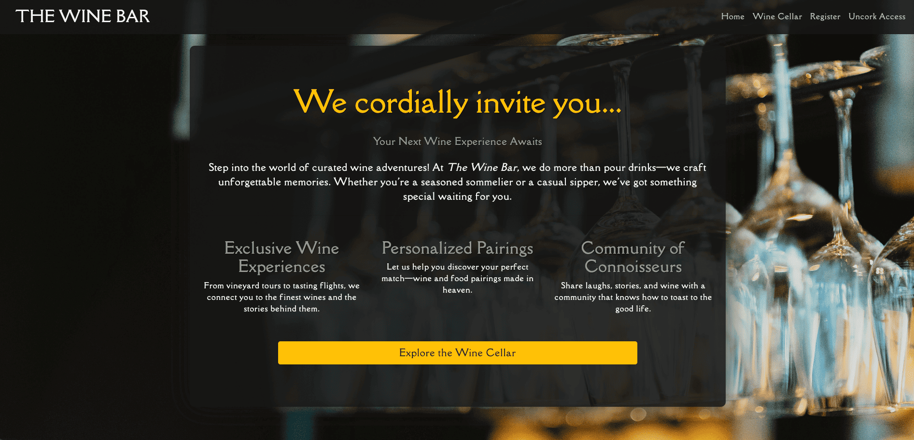
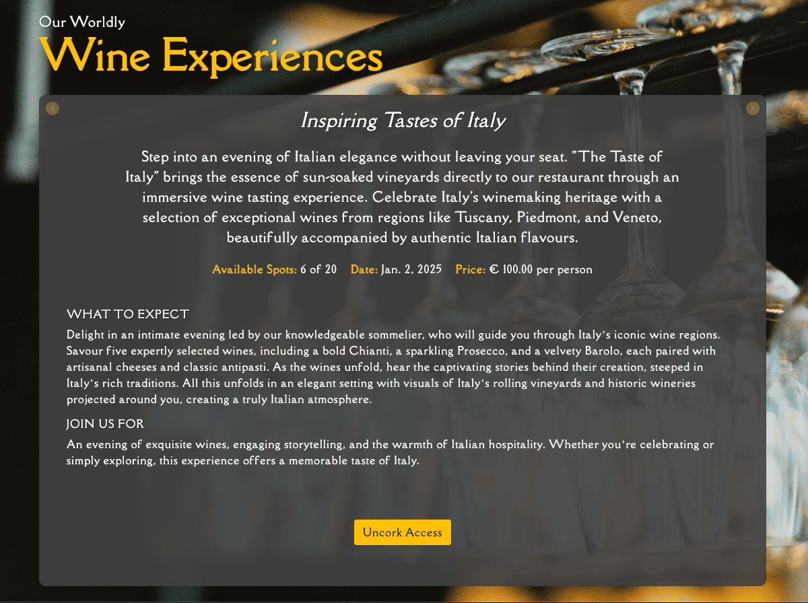
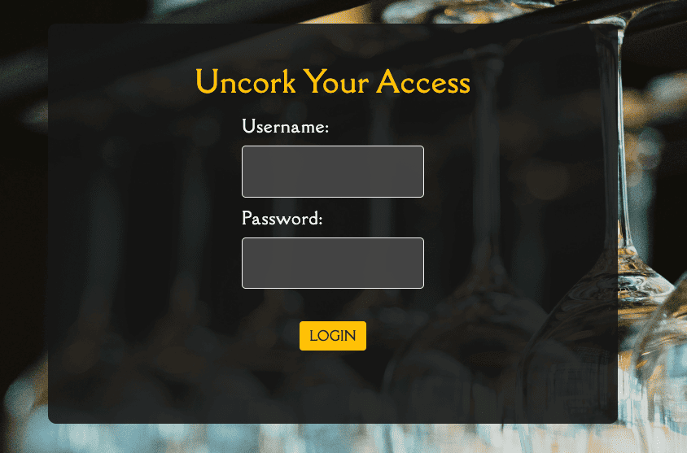
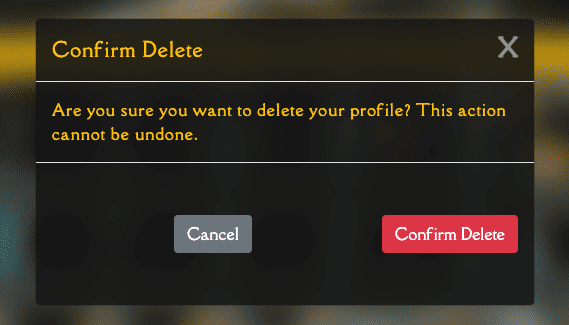
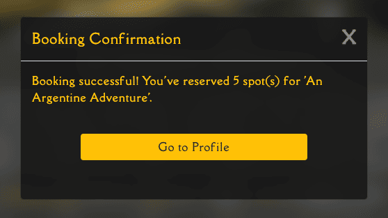
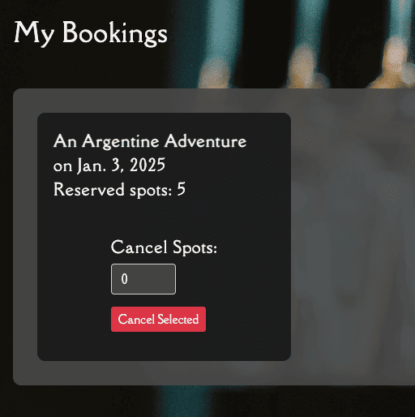

# 🍷 Wine Bar Experience 🍷

Live link: [Booking App site](https://the-wine-bar-5c52e3b945e9.herokuapp.com/)



<p>Welcome to the <strong>Wine Bar booking system</strong> a place where technology and tradition come together to create unforgettable wine-tasting moments. Imagine yourself in a cozy restaurant, surrounded by walls that come alive with projections of picturesque vineyards and stunning landscapes from around the world. This application is your gateway to curated wine adventures, right from your screen to the perfect evening under the stars.</p>


## Table of Contents

<ul> 
<li><a href="#about-the-project">About the Project</a></li> <li><a href="#user-stories">User Stories</a></li> 
<li><a href="#features">Features</a></li> 
<li><a href="#setup-and-installation">Setup and Installation</a></li>
<li><a href="#deployment">Deployment</a></li> 
<li><a href="#technologies-used">Technologies Used</a></li>
<li><a href="#testing">Testing</a></li>


## About the Project

### Purpose

<p>This is a Django-powered web application that manages the backend operations for booking and managing wine-tasting events. It handles user authentication, event scheduling, and booking management. The backend ensures seamless data flow between the database and the user interface, providing a robust platform for wine enthusiasts to explore and book immersive tasting experiences.</p>


### Target Audience

The primary target audiences include:
- **Wine Enthusiasts**: Individuals who have a passion for wine and are looking for new and exciting tasting experiences.
- **Event Organisers**: Businesses and individuals who organise wine-tasting events and need a platform to manage bookings and user interactions.
- **Restaurant Owners**: Establishments that host wine-tasting events and want to offer their customers a unique and memorable experience.

### Data

We manage different types of data to ensure a smooth and personalised experience:
- **User Data**: Information related to user registration, login, and profile management. This includes usernames, passwords, email addresses, and profile details.
- **Event Data**: Details about the wine-tasting events, such as event titles, descriptions, dates, times, and available spots.
- **Booking Data**: Information about user bookings, including the number of spots reserved, booking dates, and associated wine-tasting events.

### Security Features

Security is a critical part of the project. Several measures have been implemented for the safety and privacy of user data:
- **User Authentication**: The application uses Django's built-in authentication system to manage user registration and login securely.
- **Data Encryption**: Sensitive data, such as passwords, are encrypted using industry-standard hashing algorithms.
- **CSRF Protection**: (CSRF) is enabled to prevent unauthorized actions on behalf of authenticated users.
- **SSL/TLS**: Secure Sockets Layer and Transport Layer Security are used to encrypt data transmitted between the client and server, ensuring secure communication.
- **Session Management**: Secure session cookies are used to manage user sessions, with settings to prevent session hijacking and fixation.
- **Access Control**: Role-based access control is implemented to restrict access to certain parts of the application based on user roles (e.g., admin, user).
<br>

Return to [Table of Contents](#table-of-contents)

## User Stories

<h3>Here’s what I’ve set to built:</h3>

<p>You will find more information regarding stories on my projects in my Github. I used AGILE to keep track of the build process. This aloud me to understand what was achievable and what was a goal to far (This time 😉).</p>

Project link: [AGILE for wine Bar](https://github.com/users/TerryLoc/projects/3)

### Users

<ul> 
<li><strong>As a User:</strong> I want to create an account so that I can book wine-tasting events.</li> 
<li><strong>As a User:</strong> I want to view all available experiences so I can pick the perfect one.</li> 
<li><strong>As a User:</strong> I want detailed information about each event to make an informed decision.</li> 
<li><strong>As a User:</strong> I want to book events for myself and my friends to enjoy together.</li> 
<li><strong>As a User:</strong> I want the flexibility to cancel or modify my booking if plans change.</li> 
<li><strong>As a User:</strong> I want to receive confirmation emails so I know my booking is secure.</li> 
<li><strong>As a User:</strong> I want to view and update my profile to keep my preferences up-to-date.</li> 
</ul>

### Admin

<ul> 
<li><strong>As an Admin:</strong> I want to create new wine-tasting events to keep the offerings fresh and exciting.</li> 
<li><strong>As an Admin:</strong> I want to update event details like availability and pricing as needed.</li> 
<li><strong>As an Admin:</strong> I want to remove outdated or canceled events to maintain an up-to-date catalog.</li> <li><strong>As an Admin:</strong> I want to view all bookings for specific events to manage attendance effectively.</li> 
</ul>
<br>

Return to [Table of Contents](#table-of-contents)

## Features

### Curated Selection of Wine-Tasting Events

| Function                    | Description                                                                                                                                                                                  | Image                                                                                                              |
| --------------------------- | -------------------------------------------------------------------------------------------------------------------------------------------------------------------------------------------- | ------------------------------------------------------------------------------------------------------------------ |
| **Event Listing & Details** | Displays a carousel of available wine-tasting events from different countries.<br> While providing detailed information about each wine-tasting event, including date, time, and description |  |

### Personalized User Registration, Login, Logout and Profile Management

| Function                       | Description                                                                                                  | Image                                                                                                              |
| ------------------------------ | ------------------------------------------------------------------------------------------------------------ | ------------------------------------------------------------------------------------------------------------------ |
| **User Registration**          | New users can register an account. This functionality is handled by Django's built-in authentication system. |          |
| **User Login**                 | Users can log in with their credentials. Custom views and forms are used for this functionality.             |                    |
| **Logging Out**                | On login out the user is asked to confirm that they wish to log out of their profile access.                 |                  |
| **Profile Management**         | Users can manage their profiles, update information, and view their booking history.                         |           |
| **User Notifications**         | All actions are to the CRUD standard and the user receives notifications when an action take place.          |  |
| **Delete Profile information** | Users can delete their profile information. This action is backed up with a secondary confirmation step.     |     |

### Real-Time Booking System

| Function                 | Description                                                                                        | Image                                                                                                        |
| ------------------------ | -------------------------------------------------------------------------------------------------- | ------------------------------------------------------------------------------------------------------------ |
| **Booking Model**        | Users can book wine-tasting events with real-time updates on available spots.                      |    |
| **Booking Confirmation** | Users then receive confirmation of their booking. It also allows them to navigate to their profile |  |

### Edit Bookings 
| Function                               | Description                                                                                                                                                                                                                                                           | Image                                                                                                       |
| -------------------------------------- | --------------------------------------------------------------------------------------------------------------------------------------------------------------------------------------------------------------------------------------------------------------------- | ----------------------------------------------------------------------------------------------------------- |
| **Booking Profile display**            | On the user profile page the user can see each booking they made and all the details. <br> They can also reduce the amount of spaces booked or cancel the entire booking complete. <br> This then returns the number of space cancelled back to that wine experience. |   |
| **Booking Cancellation**               | After the user makes a change to the booking they are asked if they wish to confirm the changes                                                                                                                                                                       |  |
| **Cancellation/ Changes Confirmation** | The user is then greeted with a confirmation of the the changes made to the booking in question.                                                                                                                                                                      |  |

### Responsive and Dynamic Design

| Function                 | Description                                                                 | Image                                  |
| ------------------------ | --------------------------------------------------------------------------- | -------------------------------------- |
| **Responsive Layout**    | The site uses Bootstrap to ensure a responsive design across all devices.   |     |
| **Dynamic Interactions** | JavaScript is used to add dynamic interactions and enhance user experience. |  |

### Comprehensive Admin Panel

| Function             | Description                                                                 | Image                              |
| -------------------- | --------------------------------------------------------------------------- | ---------------------------------- |
| **Event Management** | Admin users can create, update, and delete wine-tasting events.             |  |
| **User Management**  | Admin users can manage user data and view all bookings for specific events. |   |

Return to [Table of Contents](#table-of-contents)

## Setup and Installation

1. Clone the repository:
    ```sh
    git clone https://github.com/yourusername/wine-bar-experience.git
    ```
2. Navigate to the project directory:
    ```sh
    cd wine-bar-experience
    ```
3. Create and activate a virtual environment:
    ```sh
    python -m venv venv
    source venv/bin/activate  # On Mac/Linux
    venv\Scripts\activate  # On Windows
    ```
4. Install the dependencies:
    ```sh
    pip install -r requirements.txt
    ```
5. Apply the database migrations:
    ```sh
    python manage.py migrate
    ```
6. Create a superuser:
    ```sh
    python manage.py createsuperuser
    ```
7. Run the development server:
    ```sh
    python manage.py runserver
    ```

## Usage

Once the server is running, you can access the application at `http://127.0.0.1:8000/`. From there, you can register as a user, browse available wine-tasting experiences, and make bookings. Admin users can log in to the admin panel to manage events and user data.
<br>

Return to [Table of Contents](#table-of-contents)

## Deployment

### Deploying to Heroku

Follow these steps to deploy the Wine Bar Experience Django project to Heroku.

### Create the Heroku App

1. Navigate to your Heroku dashboard and create a new app with a unique name.

2. Click on the **Settings** tab and reveal the config vars. Add a key of `DISABLE_COLLECTSTATIC` and a value of `1`, then click **Add**.

### Update Your Code for Deployment

3. Install a production-ready web server for Heroku:
    ```sh
    pip3 install gunicorn~=20.1
    ```

4. Add `gunicorn` to the [requirements.txt](http://_vscodecontentref_/0) file:
    ```sh
    pip3 freeze --local > requirements.txt
    ```

5. Create a file named [Procfile](http://_vscodecontentref_/1) at the root directory of the project (same directory as [requirements.txt](http://_vscodecontentref_/2)):
    ```sh
    echo "web: gunicorn my_project.wsgi" > Procfile
    ```

6. Open the `my_project/settings.py` file and replace `DEBUG=True` with `DEBUG=False`:
    ```python
    DEBUG = False
    ```

7. Also, in `settings.py`, append the Heroku hostname to the `ALLOWED_HOSTS` list:
    ```python
    ALLOWED_HOSTS = ['.herokuapp.com']
    ```

8. Commit the changes and push them to GitHub:
    ```sh
    git add .
    git commit -m "Prepare for Heroku deployment"
    git push origin main
    ```

### Deploy on Heroku

9. Return to the Heroku dashboard, and in your app, click on the **Deploy** tab.

10. In the **Deployment method** section, enable GitHub integration by clicking on **Connect to GitHub**.

11. Search for your project repo name and click **Search**. Select the GitHub repo you want to deploy from.

12. Scroll to the bottom of the page and click **Deploy Branch** to start a manual deployment of the main branch.

13. Click on **Open app** to view your deployed project.

14. Open the **Resources** tab and choose an eco dyno. This dyno is a lightweight container to run your project.

15. Verify there is no existing Postgres database add-on in the **Resources** tab. If there is one, you can destroy it to avoid usage costs.

16. Click on **Open app** to view your deployed project.

Your Wine Bar Experience Django project should now be successfully deployed on Heroku.
<br>

Return to [Table of Contents](#table-of-contents)
## Technologies Used

- **Django**: The primary web framework used for building the backend of the application. It handles user authentication, event scheduling, and booking management.
  
- **Gunicorn**: A production-ready web server for running the Django application on Heroku.
  
- **Heroku**: The platform used for deploying the application.

<hr>

- **SQLite**: The database used for development. It stores user data, event details, and booking information.

### Data Structure

| Description                              | Image                                                                                                                |
| ---------------------------------------- | -------------------------------------------------------------------------------------------------------------------- |
| Detailed UML Diagram of WineCellar Model |                 |
| Detailed Views Diagram                   |  |

<hr>

- **Whitenoise**: A Python package that helps serve static files in a Django application.


### What is WhiteNoise

WhiteNoise is a Python package that helps serve static files in a Django application. It is particularly useful in production environments where you need a reliable and efficient way to serve static assets like CSS, JavaScript, and images.

#### Key Benefits of WhiteNoise:

1. **Simplifies Static File Handling**: WhiteNoise allows your Django application to serve its own static files, eliminating the need for a separate web server or CDN for static assets.
   
2. **Efficient Caching**: It provides efficient caching mechanisms, including support for cache headers and compression, which can improve the performance of your site.
   
3. **Easy Integration**: WhiteNoise integrates seamlessly with Django, requiring minimal configuration changes.
   
4. **Security**: It helps ensure that static files are served securely, with appropriate headers to prevent issues like MIME type sniffing.

### To use WhiteNoise:

1. **Install WhiteNoise**:
    ```sh
    pip install whitenoise
    ```

2. **Add WhiteNoise to Middleware**:
    Add `WhiteNoiseMiddleware` to the `MIDDLEWARE` list in your `settings.py` file, preferably right after `SecurityMiddleware`:
    ```python
    MIDDLEWARE = [
        "django.middleware.security.SecurityMiddleware",
        "whitenoise.middleware.WhiteNoiseMiddleware",
        "django.contrib.sessions.middleware.SessionMiddleware",
        "django.middleware.common.CommonMiddleware",
        "django.middleware.csrf.CsrfViewMiddleware",
        "django.contrib.auth.middleware.AuthenticationMiddleware",
        "django.contrib.messages.middleware.MessageMiddleware",
        "django.middleware.clickjacking.XFrameOptionsMiddleware",
    ]
    ```

3. **Collect Static Files**:
    Run the `collectstatic` command to gather all static files into the `STATIC_ROOT` directory:
    ```sh
    python manage.py collectstatic
    ```

By following these steps, WhiteNoise will handle your static files efficiently and securely.

<hr>
  
- **HTML/CSS**: Used for structuring and styling the frontend of the application.
  
- **JavaScript**: Adds interactivity to the frontend, including dynamic updates and immersive projections.
  
- **Bootstrap**: A CSS framework used for responsive design and styling.
  
- **Python**: The programming language used to develop the Django application.
  
- **Git**: Version control system used for tracking changes and collaborating on the project.
  
- **GitHub**: The platform used for hosting the project's repository and integrating with Heroku for deployment.
<br>

Return to [Table of Contents](#table-of-contents)

## Testing

To ensure that the Wine Bar Experience application is working correctly, follow these steps to run tests and verify the functionality of the app.

### Running Tests

1. **Navigate to the Project Directory**:
    ```sh
    cd wine-bar-experience
    ```

2. **Run Django Tests**:
    Django comes with a built-in testing framework. You can run the tests using the following command:
    ```sh
    python manage.py test
    ```

3. **Check Test Coverage**:
    To check the test coverage, you can use the `coverage` package. First, install it if you haven't already:
    ```sh
    pip install coverage
    ```

    Then, run the tests with coverage:
    ```sh
    coverage run --source='.' manage.py test
    ```

    Finally, generate a coverage report:
    ```sh
    coverage report
    ```

### Coverage Report

| Name                                                              | Stmts | Miss | Cover |
| ----------------------------------------------------------------- | ----- | ---- | ----- |
| bookings/__init__.py                                              | 0     | 0    | 100%  |
| bookings/admin.py                                                 | 13    | 0    | 100%  |
| bookings/apps.py                                                  | 4     | 0    | 100%  |
| bookings/forms.py                                                 | 43    | 20   | 53%   |
| bookings/migrations/0001_initial.py                               | 7     | 7    | 0%    |
| bookings/migrations/0002_winecellar_total_spots.py                | 4     | 4    | 0%    |
| bookings/migrations/0003_remove_userprofile_bookings_booking.py   | 6     | 6    | 0%    |
| bookings/migrations/__init__.py                                   | 0     | 0    | 100%  |
| bookings/models.py                                                | 49    | 16   | 67%   |
| bookings/tests.py                                                 | 1     | 0    | 100%  |
| bookings/urls.py                                                  | 5     | 0    | 100%  |
| bookings/views.py                                                 | 90    | 68   | 24%   |
| manage.py                                                         | 11    | 2    | 82%   |
| win_bar/__init__.py                                               | 0     | 0    | 100%  |
| win_bar/asgi.py                                                   | 4     | 4    | 0%    |
| win_bar/settings.py                                               | 28    | 0    | 100%  |
| win_bar/urls.py                                                   | 9     | 1    | 89%   |
| win_bar/views.py                                                  | 3     | 1    | 67%   |
| win_bar/wsgi.py                                                   | 4     | 4    | 0%    |
| ----------------------------------------------------------------- | ----- | ---- | ----- |
| TOTAL                                                             | 281   | 133  | 53%   |

### Additional Testing

#### Manual Testing: 

| Test Case            | Status   | Description                                                                              |
| -------------------- | -------- | ---------------------------------------------------------------------------------------- |
| User Registration    | ✅ Passed | Ensure that users can register successfully and receive a confirmation message.          |
| User Login           | ✅ Passed | Verify that users can log in with valid credentials and are redirected to their profile. |
| Wine List Display    | ✅ Passed | Check that the list of available wine experiences is displayed correctly.                |
| Booking Creation     | ✅ Passed | Ensure that users can create bookings for wine-tasting events.                           |
| Booking Cancellation | ✅ Passed | Verify that users can cancel their bookings and receive a confirmation message.          |
| Admin Panel Access   | ✅ Passed | Ensure that admin users can access the admin panel and manage events and user data.      |
| Static Files Serving | ✅ Passed | Verify that static files (CSS, JS, images) are served correctly in production.           |
| Responsive Design    | ✅ Passed | Check that the site is responsive and works well on desktop, tablet, and mobile devices. |

  
- **Browser Compatibility**:

- **Performance Testing**:
